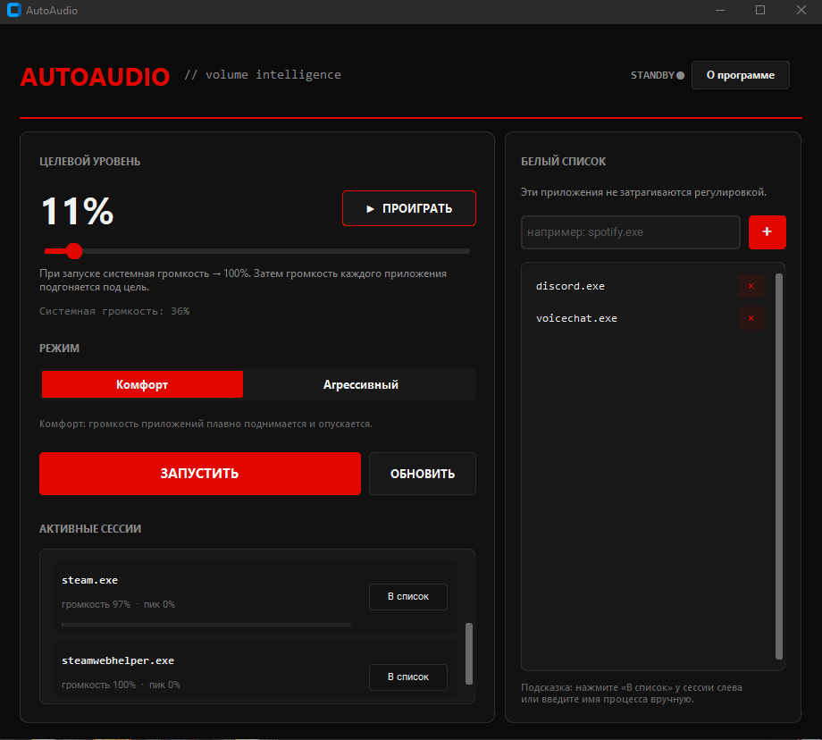

<p align="center">
  
</p>

<h1 align="center">🔊 AutoAudio</h1>

<p align="center">
  <strong>Умная автоматическая регулировка громкости для Windows</strong><br>
  <code>volume intelligence</code> · <strong>v1.0.0</strong>
</p>

<p align="center">
  
  
  

</p>


---

## 📸 Скриншот

<p align="center">
  

</p>

<p align="center">

</p>

---

## 🎯 Для чего эта программа?

**AutoAudio** - это утилита для Windows, которая **автоматически выравнивает громкость** всех звучащих приложений под один уровень.

Знакомая ситуация?

- 🎬 YouTube орёт на полную, а Discord еле слышно  
- 🎮 Игра громче всего остального  
- 🎚️ Системная громкость на 30%, а приложения уже на 100%  
- 😤 Постоянно крутишь ползунки в микшере Windows  

**AutoAudio решает это за вас:**

| Шаг | Что происходит |
|:---:|----------------|
| 1️⃣ | Системная громкость поднимается до **100%** |
| 2️⃣ | Громкие приложения **убавляются** до целевого уровня |
| 3️⃣ | Тихие приложения **прибавляются** до того же уровня |
| 4️⃣ | Приложения из белого списка **не трогаются** |
| 5️⃣ | При остановке системная громкость **возвращается** как была |

---

## ✨ Что умеет программа

### 🎛️ Основные функции

- **Целевой уровень** - ползунок 5%–100%, выбираете комфортную громкость
- **▶ ПРОИГРАТЬ** - тестовый звук на выбранном уровне перед запуском
- **ЗАПУСТИТЬ / ОСТАНОВИТЬ** - одна кнопка для включения автоматики
- **Мониторинг сессий** - список активных приложений с пиком и громкостью
- **Автосохранение** - настройки запоминаются в `config.json`

### 🐢 ⚡ Два режима работы

| | 🐢 Комфорт | ⚡ Агрессивный |
|---|:---:|:---:|
| Подъём громкости | Плавный | Мгновенный |
| Спад громкости | Плавный | Мгновенный |
| Интервал | 100 мс | 30 мс |
| Для кого | Повседневное использование | Быстрая коррекция |

### 🛡️ Белый список

Исключите приложения, которые не нужно регулировать:

- Добавление кнопкой **«В список»** у активной сессии
- Ручной ввод имени процесса (`discord.exe`, `spotify.exe`)
- Удаление одним кликом

### ℹ️ О программе

Отдельное окно с логотипом, подписью **ErkinKraft**, версией и лицензией **MIT**.

---

## 🧠 Как это работает

```
  ┌──────────────────────────────────────────┐
  │         🎚️ Системная громкость           │
  │              ──────► 100%                │
  └──────────────────┬───────────────────────┘
                     │
         ┌───────────┼───────────┐
         ▼           ▼           ▼
    ┌─────────┐ ┌─────────┐ ┌─────────┐
    │ 🎮 Game │ │ 🌐 Browser│ │ 💬 Discord│
    │  🔉 45% │ │  🔊 100% │ │ 🛡️ skip  │
    └─────────┘ └─────────┘ └─────────┘
         │           │
         ▼           ▼
    подогнано    подогнано
    под цель     под цель
```

**Алгоритм:**

```
source ≈ peak / app_volume     # «сырой» уровень звука приложения
desired = target / source      # нужная громкость ползунка
new_vol = apply(desired, mode) # плавно (Комфорт) или сразу (Агрессивный)
```

---

## 🚀 Быстрый старт

### 📋 Требования

| | |
|---|---|
| 🖥️ ОС | Windows 10 / 11 |
| 🐍 Python | 3.10 и выше |
| 🔊 Аудио | Работающий выход (колонки / наушники) |

### 📦 Установка

```bash
git clone <url-репозитория>
cd AutoAudio
pip install -r requirements.txt
```

### ▶️ Запуск

```bash
python main.py
```

Или двойной клик по **`run.bat`**.

### 📖 Инструкция

1. 🎚️ Установите **целевой уровень** ползунком
2. ▶️ Нажмите **«ПРОИГРАТЬ»** - проверьте звучание
3. 🐢 / ⚡ Выберите **Комфорт** или **Агрессивный**
4. 🚀 Нажмите **«ЗАПУСТИТЬ»**
5. 🛡️ Добавьте нужные приложения в **белый список**

---

## 📁 Структура проекта

```
AutoAudio/
│
├── 🖥️ main.py              # Главное окно и интерфейс
├── ⚙️ audio_engine.py       # Движок регулировки громкости
├── 🔊 preview_sound.py      # Тестовый звук для превью
├── 📋 requirements.txt      # Зависимости Python
├── ▶️ run.bat               # Быстрый запуск
├── 💾 config.json           # Настройки (создаётся автоматически)
├── 🖼️ logoW.png             # Логотип ErkinKraft
├── 📸 screen.PNG            # Скриншот интерфейса
└── 📖 README.md             # Этот файл
```

---

## ⚙️ Техническая информация

### 🧱 Стек технологий

| Компонент | Библиотека | Версия | Назначение |
|-----------|------------|--------|------------|
| **GUI** | CustomTkinter | ≥ 5.2.2 | Тёмный современный интерфейс |
| **Аудио** | pycaw | ≥ 20240210 | WASAPI - управление громкостью |
| **COM** | comtypes | ≥ 1.4.0 | Доступ к Windows Audio API |
| **Изображения** | Pillow | ≥ 10.0.0 | Логотип в окне «О программе» |
| **Звук** | numpy | ≥ 1.26.0 | Генерация превью-сигнала |

### 🏗️ Архитектура

```
┌─────────────┐     ┌──────────────────┐     ┌─────────────────┐
│   main.py   │────►│  audio_engine.py │────►│  Windows WASAPI  │
│  (GUI/UX)   │◄────│  (фоновый поток) │◄────│  Audio Sessions  │
└─────────────┘     └──────────────────┘     └─────────────────┘
       │                     │
       ▼                     ▼
 preview_sound.py       config.json
 (тестовый тон)         (настройки)
```

**Ключевые Windows API:**

| Интерфейс | Назначение |
|-----------|------------|
| `ISimpleAudioVolume` | Громкость отдельного приложения (0.0–1.0) |
| `IAudioMeterInformation` | Пиковый уровень звукового потока |
| `IAudioEndpointVolume` | Системная (главная) громкость |

**`AudioEngine`** - фоновый поток (`threading.Thread`), который:

1. Сохраняет текущую системную громкость
2. Устанавливает системную громкость на **100%**
3. Каждые 30–100 мс опрашивает все аудиосессии
4. Корректирует громкость каждого приложения
5. При остановке восстанавливает системную громкость

### 📊 Параметры режимов

| Параметр | 🐢 Комфорт | ⚡ Агрессивный |
|----------|:----------:|:--------------:|
| `interval` | 0.10 с | 0.03 с |
| `boost_step` | 7% | мгновенно |
| `cut_step` | 5% | мгновенно |
| `peak_smooth` | 40% EMA | без сглаживания |

### 💾 Конфигурация

Файл `config.json` создаётся автоматически:

```json
{
  "target": 0.45,
  "mode": "comfort",
  "whitelist": ["discord.exe", "voicechat.exe"]
}
```

| Поле | Тип | Описание |
|------|-----|----------|
| `target` | `float` | Целевой уровень (0.05 – 1.0) |
| `mode` | `string` | `"comfort"` или `"aggressive"` |
| `whitelist` | `string[]` | Процессы без регулировки |

### 🎨 Цветовая палитра

| Элемент | HEX | Использование |
|---------|-----|---------------|
| Фон | `#0B0B0B` | Основной фон окна |
| Панели | `#121212` | Карточки и блоки |
| Панели 2 | `#181818` | Вложенные элементы |
| Акцент | `#E10600` | Кнопки, слайдер, заголовок |
| Свечение | `#FF1A1A` | Hover-эффекты |
| Текст | `#F2F2F2` | Основной текст |
| Приглушённый | `#8A8A8A` | Подписи и подсказки |

---

## ⚠️ Ограничения

- 🖥️ Только **Windows** (WASAPI)
- 🔊 Нельзя сделать громче, чем позволяет источник при 100% громкости приложения
- 🎮 Некоторые игры и DRM-приложения могут не отображаться в сессиях
- 🔇 Заглушённые (muted) приложения пропускаются
- 🎧 Работает с устройством вывода по умолчанию

---

## 📜 Лицензия

**MIT License** · Copyright (c) 2026 **ErkinKraft**

Свободное использование, изменение и распространение.  
Полный текст - в окне **«О программе»** или в `main.py`.

---

<p align="center">
  
</p>

<p align="center">
  <strong>ErkinKraft</strong><br>
  AutoAudio v1.0.0<br>
  <sub>🔴 Сделано для комфортного звука</sub>
</p>
